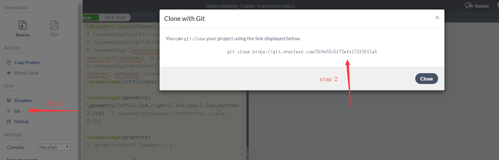

本文是 overleaf 的 git 功能的使用教程。

- git 客户端：https://gitforwindows.org/
- tutorial for git: [git - the simple guide](https://rogerdudler.github.io/git-guide/)

___

- 首先，按下图操作，把 `git clone ...` 复制下来


- 然后在电脑内想存放文档的文件夹内右键，选择 `git bash here`，在窗口内粘贴 
    ```bash
    git clone https://git.overleaf.com/xxxxxxxxx
    ```
    此时 overleaf 上的文档应该会被下载到本地
- 每次修改之前，运行下面两个命令
    ```bash
    git fetch origin # 下载 overleaf 上的最新版到本地
    git merge origin master # 和本地文件合并
    ```
    上面两条命令等价于 `git pull origin master`。`origin/master` 对应于 overleaf 上的文件。

- 如果本地文件跟云端的文件修改了同一处地方，那么在 merge 的时候可以会提示有 conflict。这个时候就需要手动 resolve conflict。这个过程会比较麻烦，所以，为了尽量避免，建议经常把云端的修改 pull 下来，或者你每次要本地修改的时候跟我说一下，我就先不在 overleaf 上改。

- 运行 `git status` 可以查看本地有哪些文件被修改了。本地修改完之后，输入下面三条命令来 push 到 overleaf
    ```bash
    git add . # 这条命令会 propose changes，
    # 其中，. 表示 add 所有修改过的文件，也可以只添加某个文件，具体 git - the simple guide
    git commit -m "MESSAGE" # 这条命令是 commit changes，-m 后面加本次的修改信息，比如修改了哪一节
    git push origin master # 这行会把本地的修改 push 到 overleaf 上
    ```
- 注意，如果本地修改之前忘记把 overleaf 上最新的文件 pull 下来，那么在最后 push 的时候，会提示错误。解决方法是先 pull 下来。如果本地修改跟云端修改不在同一行，那么可以自动合并；否则，会提示有 conflict。**为避免这个麻烦，本地修改前务必记得先 pull。**

- 最后，vs code 内集成了 git，也能编辑 latex，可以图形化地使用，并且能自动 fetch origin，这样就能随时看到云端有没有被修改了。不过配置会有点麻烦，爱折腾的可以玩一玩。